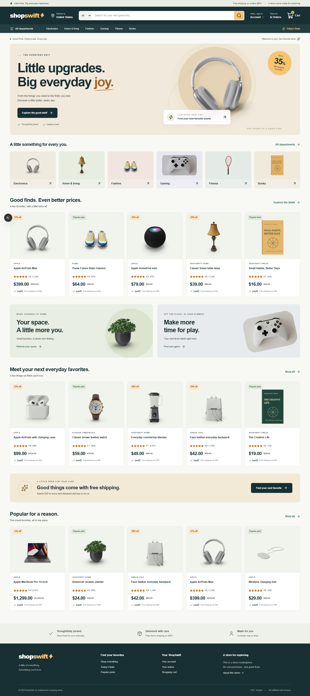

# ShopSwift

An Amazon-inspired marketplace with original branding, a local catalog, and a complete browser-persisted demo shopping journey. Built for the 8x engineering take-home assignment.

**Public repository:** https://github.com/UsmanZafar47/shopswift-8x

**Deployment:** awaiting the final authenticated Vercel deployment. The production URL will be recorded here after verification.



More previews: [mobile homepage](docs/screenshots/home-mobile.png), [checkout](docs/screenshots/checkout-desktop.png), and [mobile confirmation](docs/screenshots/confirmation-mobile.png).

## Try it locally

Use Node.js 22 or newer and npm.

```sh
npm ci
npm run dev
```

Open http://localhost:3000. No environment variables, database, API keys, or paid services are required.

For a production run:

```sh
npm run build
npm start
```

## Demo account

Choose **Continue as demo user** at sign-in or checkout, or use:

- Email: `demo@shopswift.com`
- Password: `demo123`

You can also create a fictional account. Use a made-up password and the **Use demo address** button. Nothing is charged or shipped. Accounts and orders are isolated by email within the current browser; they are not server-authenticated accounts.

## What works

- 20 local products across Electronics, Home, Fashion, Gaming, Fitness, and Books.
- Search suggestions with keyboard navigation; category, price, rating, and discount filters; sorting encoded in the URL.
- Product image galleries, variants, ratings, quantity selection, Add to cart, and Buy now.
- Persistent variant-aware cart, quantity editing, removal, and save for later.
- Demo sign-in/sign-up, saved address, standard/express shipping, demo card or simulated payment on delivery.
- Order review, confirmation, persistent order history, and Buy again.
- Desktop and mobile layouts, focus states, feedback toasts, validation, empty states, loading UI, and custom 404s.
- Local images served directly with Next.js Image layout handling; no runtime product or image API dependency.

## Stack and structure

Next.js App Router, React, TypeScript, Tailwind CSS, Lucide icons, and localStorage. No backend service is needed.

```text
app/                 Routes, metadata, global styling, loading/error pages
components/          Store provider and shopping interfaces
lib/catalog.json     The local catalog
lib/catalog.ts       Catalog types and helpers
public/products/     Bundled product photography and original book artwork
research/            Build brief, Amazon research screenshots, asset sources
scripts/             Agent capture, browser tests, and catalog preparation
.agent-logs/         Automatic raw prompts and final replies
```

Prices use integer-cent arithmetic when computing order subtotals. Shipping is free from $50, otherwise $4.99; express is $9.99. Demo tax is zero. Orders snapshot their items and totals at purchase time. A failed storage write preserves the cart and displays an error rather than reporting an unsaved order as successful.

## Routes

| Route | Purpose |
| --- | --- |
| `/` | Marketplace homepage |
| `/search` | Search, departments, filters, and sorting |
| `/product/[id]` | Product details and purchase controls |
| `/cart` | Cart and saved items |
| `/signin` | Demo sign-in and sign-up |
| `/checkout` | Address, shipping/payment, and review |
| `/order-confirmation/[id]` | Saved order details |
| `/orders` | Current account's demo orders |
| `/account` | Profile and saved delivery address |
| `/about` | Demo behavior and limitations |

## Checks

```sh
npm run lint
npm run build
npm run test:e2e
node scripts/test-accessibility.cjs
```

The browser tests use an installed Google Chrome. If needed, install Chrome or change Playwright's `channel` setting and install its Chromium browser. Start the app before running browser tests. To test a different server, set `TEST_BASE_URL` (for example, `http://127.0.0.1:3001`). Browser screenshots and reports are written to ignored `test-results/`.

## Decisions and limits

See [PRODUCT_NOTES.md](PRODUCT_NOTES.md) for observed Amazon behavior and scope choices. The public homepage, search, product, guest cart, and sign-in gate were inspected. Account-gated Amazon checkout screens were not personally verified; no private information or real payment was entered.

This is a frontend simulation. No real payments, sellers, shipping infrastructure, subscriptions, admin, live stock, email delivery, or full Amazon parity. Local passwords are digested for this demo, but this is not secure production authentication. Clearing browser storage removes demo data. Product prices, discounts, ratings, reviews, and delivery dates are illustrative. ShopSwift is not affiliated with Amazon or the displayed manufacturers.

Image sources and the original book artwork are documented in [research/ASSET_SOURCES.md](research/ASSET_SOURCES.md).

## Agent capture and walkthrough

Capture was installed and tested in two independent real Codex sessions before implementation. See [CAPTURE-TEST.md](CAPTURE-TEST.md). The watcher exports only this repository's user prompts and final replies, with UTC timestamps and model identifiers. Logs are committed throughout development. After restarting the machine, follow the watcher startup instructions in [AGENTS.md](AGENTS.md).

Use [WALKTHROUGH_SCRIPT.md](WALKTHROUGH_SCRIPT.md) for a recording under five minutes. **Keep your camera on.**
