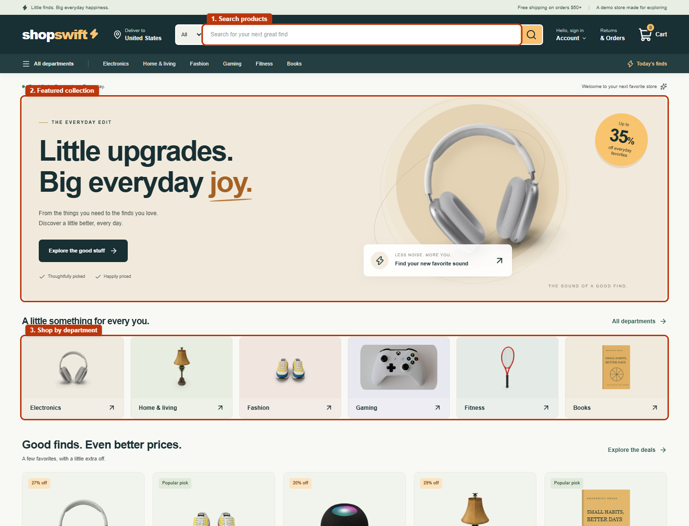
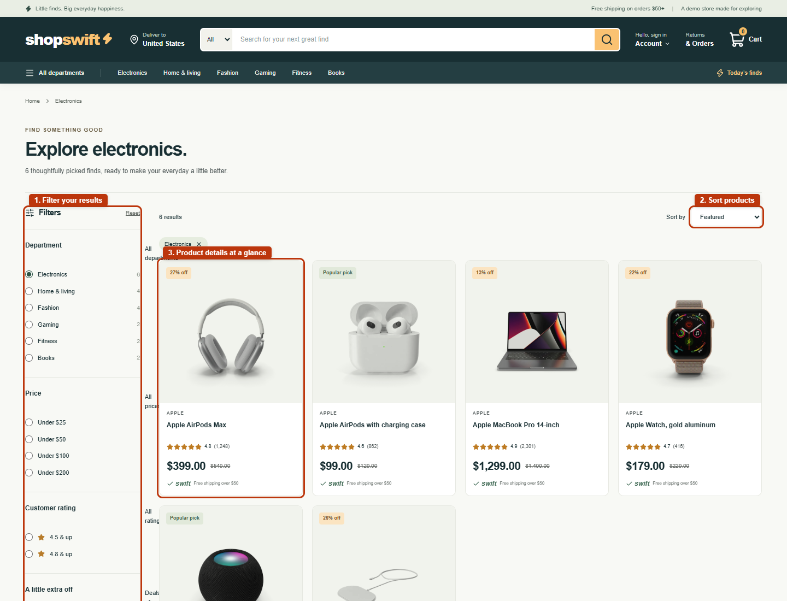
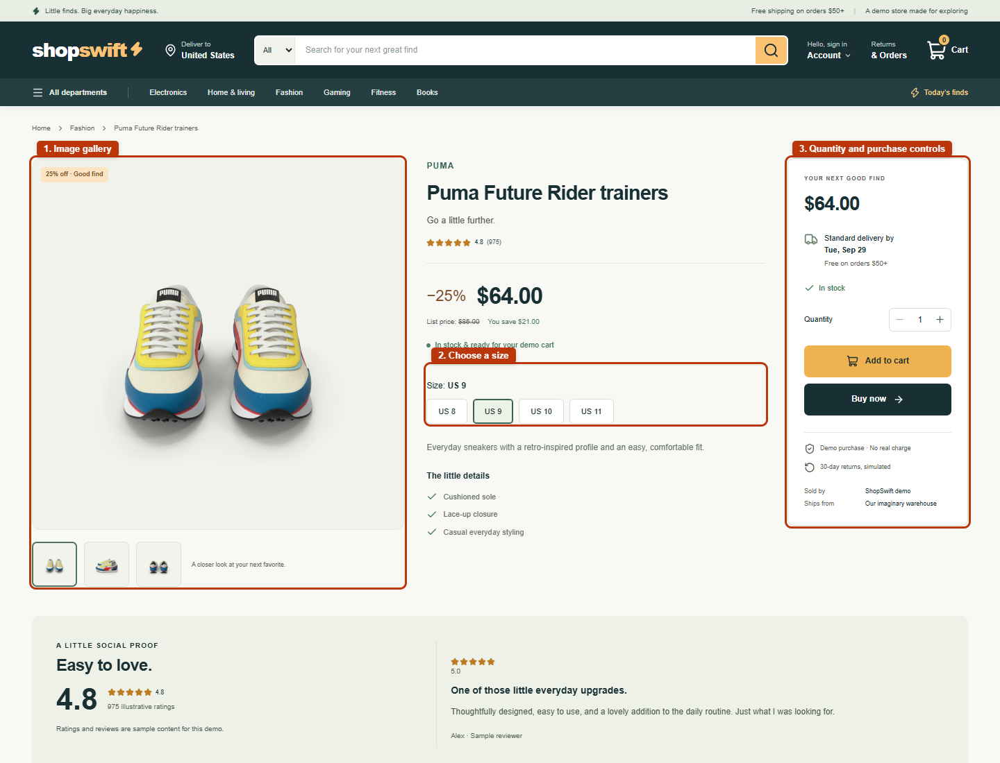
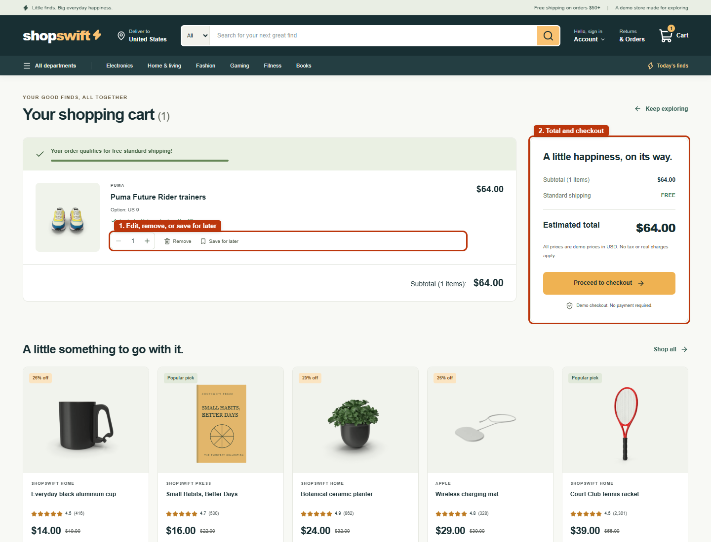
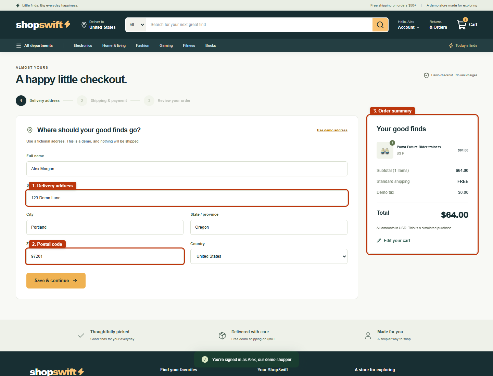
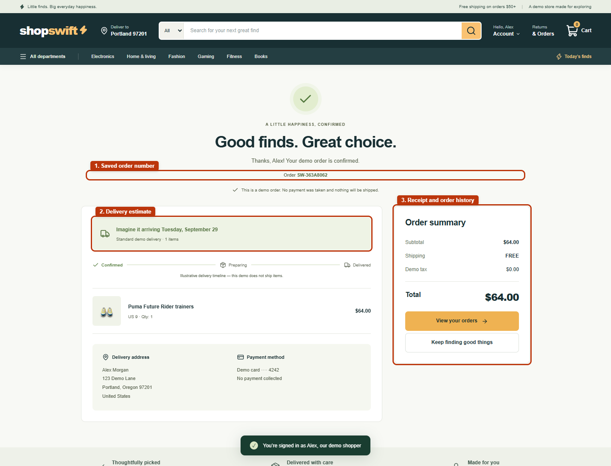

# ShopSwift feature screenshots

Six screenshots captured from https://shopswift-8x.vercel.app. Numbered red outlines identify key controls and features; these annotations are only in the screenshots, not the deployed app. Checkout uses the built-in fictional demo address.

Unannotated versions are in [clean/](clean/).

## 1. Homepage

## 2. Search and filters

## 3. Product options

## 4. Shopping cart

## 5. Checkout fields

## 6. Order confirmation

